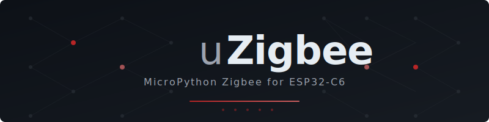

<div align="center">
  

  <p><strong>MicroPython Zigbee library for ESP32-C6</strong></p>
  <p>Built on ESP-Zigbee-SDK (ZBOSS) · Production-ready · RAM-optimized</p>

  <br>

  <a href="LICENSE"></a>
  <a href="https://github.com/espressif/esp-idf/releases/tag/v5.3.2"></a>
  <a href="https://github.com/micropython/micropython/releases/tag/v1.27.0"></a>
  <a href="https://www.espressif.com/en/products/socs/esp32-c6"></a>
  <a href="https://csa-iot.org/all-solutions/zigbee/"></a>
  <a href="https://github.com/mateuszsury/uZigbee/actions/workflows/firmware-artifacts.yml"></a>
  <a href="https://github.com/mateuszsury/uZigbee/pulls"></a>

  <br><br>
</div>

---

## What is uZigbee?

**uZigbee** is a MicroPython library that brings full Zigbee 3.0 support to the ESP32-C6 through a native C bridge to the ESP-Zigbee-SDK (ZBOSS stack). It provides high-level Python APIs for Coordinator, Router, and EndDevice roles — with production tooling for build, flash, HIL testing, and CI/CD. Designed for the ESP32-C6's 512 KB SRAM constraint with zero PSRAM dependency.

---

## Key Features

<table>
  <tr>
    <td align="center" width="33%">
      <br>
      <strong>Native C Bridge</strong><br>
      <sub>Zero-overhead MicroPython-to-Zigbee binding via ESP-Zigbee-SDK. Direct ZBOSS stack access with scheduler-safe callbacks.</sub>
    </td>
    <td align="center" width="33%">
      <br>
      <strong>Full Zigbee Roles</strong><br>
      <sub>Coordinator, Router, and EndDevice APIs with auto commissioning (auto / guided / fixed), discovery, and lifecycle management.</sub>
    </td>
    <td align="center" width="33%">
      <br>
      <strong>Smart Home Ready</strong><br>
      <sub>First-class Zigbee2MQTT and Home Assistant integration with Z2M external converters and device pairing workflows.</sub>
    </td>
  </tr>
  <tr>
    <td align="center" width="33%">
      <br>
      <strong>Production Tooling</strong><br>
      <sub>Build, flash, host tests, hardware-in-the-loop (HIL) testing, and CI/CD firmware artifact pipelines.</sub>
    </td>
    <td align="center" width="33%">
      <br>
      <strong>RAM-Optimized</strong><br>
      <sub>Designed for ESP32-C6 constraints: 512 KB SRAM, no PSRAM. Frozen modules and minimal allocation hot paths.</sub>
    </td>
    <td align="center" width="33%">
      <br>
      <strong>Rich Protocol Support</strong><br>
      <sub>OTA firmware updates, GreenPower, Touchlink, ZCL cluster library, reporting, binding, and security features.</sub>
    </td>
  </tr>
</table>

---

## Supported Hardware

| Board | SoC | Zigbee Radio | Notes |
|---|---|---|---|
| [ESP32-C6-DevKitC-1](https://docs.espressif.com/projects/esp-dev-kits/en/latest/esp32c6/esp32-c6-devkitc-1/) | ESP32-C6 | IEEE 802.15.4 | Primary development board |
| ESP32-C6-DevKitM-1 | ESP32-C6 | IEEE 802.15.4 | Module variant |
| Generic ESP32-C6 | ESP32-C6 | IEEE 802.15.4 | Any board with ESP32-C6 |

> All boards require ESP32-C6 with built-in IEEE 802.15.4 radio. WiFi 6 and BLE 5.0 coexist on the same chip.

---

## Quick Start

### 1. Bootstrap dependencies (WSL / Linux)

```bash
git clone https://github.com/mateuszsury/uZigbee.git
cd uZigbee
bash tools/bootstrap_third_party.sh
```

### 2. Build firmware

```bash
./build_firmware.sh --profile esp32-c6-devkit --skip-mpy-cross
```

### 3. Flash from Windows

Use offsets from `<build_dir>/flash_args` to flash the firmware to your board.

### 4. Run host tests

```bash
python -m pytest tests/test_import.py tests/test_network_api.py -q
```

### 5. Run HIL smoke tests

```bash
python tools/hil_runner.py --ports COM3 COM5 --tests tests/hil_basic_identity_smoke.py --retries 3
```

> Full commands and variants are in [BUILD.md](docs/BUILD.md) and [EXAMPLES.md](docs/EXAMPLES.md).

---

## Architecture

<div align="center">
  
</div>

<br>

The uZigbee stack is organized in layers:

- **ESP32-C6** runs FreeRTOS with the RISC-V core and IEEE 802.15.4 radio
- **C Bridge** wraps ESP-Zigbee-SDK (ZBOSS) with MicroPython-compatible native modules
- **Python API** exposes high-level Coordinator, Router, and EndDevice abstractions
- **Zigbee Network** handles ZCL clusters, mesh routing, and device management
- **Smart Home** integrates with Zigbee2MQTT and Home Assistant via standard protocols

---

## Project Structure

```
uZigbee/
├── c_module/           # Native MicroPython C bridge and Zigbee integration
├── python/uzigbee/     # Python API (core + high-level orchestration)
├── firmware/           # Manifests, sdkconfig defaults, partitions, board profiles
├── examples/           # Runnable device and coordinator examples
├── tests/              # Host and HIL tests
├── tools/              # Build / flash / test runners and utilities
├── docs/               # Full project documentation
├── z2m_converters/     # Zigbee2MQTT external converter definitions
└── assets/             # SVG branding and diagrams
```

---

## Documentation

| Document | Description |
|---|---|
| [Getting Started](docs/GETTING_STARTED.md) | First-time setup guide |
| [Build & Flash](docs/BUILD.md) | Build system, profiles, and flash procedures |
| [API Reference](docs/API.md) | Full Python API documentation |
| [Usage Examples](docs/EXAMPLES.md) | Runnable code examples |
| [Zigbee2MQTT Guide](docs/Z2M_GUIDE.md) | Z2M integration and converter setup |
| [Home Assistant](docs/HA_INTEGRATION.md) | HA integration workflows |
| [Memory Constraints](docs/MEMORY.md) | RAM budget and optimization notes |
| [License Notes](docs/LICENSE_NOTES.md) | Zigbee binary licensing details |

---

## Testing

uZigbee uses a two-tier testing strategy:

- **Host tests** — fast, hardware-free validation of Python APIs and import sanity
- **HIL tests** — hardware-in-the-loop smoke tests on real ESP32-C6 boards with multi-device Zigbee scenarios

```bash
# Host tests
python -m pytest tests/test_import.py tests/test_network_api.py -q

# HIL tests (requires two boards)
python tools/hil_runner.py --ports COM3 COM5 --tests tests/hil_basic_identity_smoke.py --retries 3
```

CI builds firmware artifacts automatically via [GitHub Actions](.github/workflows/firmware-artifacts.yml).

---

## Contributing

Contributions are welcome! Please read the [Contributing Guide](CONTRIBUTING.md) before opening a PR.

- Follow the [Code of Conduct](CODE_OF_CONDUCT.md)
- Check existing [issues](https://github.com/mateuszsury/uZigbee/issues) for related work
- See [Good First Issues](https://github.com/mateuszsury/uZigbee/labels/good%20first%20issue) for beginner-friendly tasks

---

## License

Project source code is licensed under the [MIT License](LICENSE).

> **Important:** Zigbee binary dependencies (e.g., `esp-zboss-lib`) have separate redistribution terms. Review [LICENSE_NOTES.md](docs/LICENSE_NOTES.md) before publishing firmware binaries.

---

<div align="center">
  <br>
  <a href="https://github.com/mateuszsury/uZigbee">GitHub</a> ·
  <a href="https://github.com/mateuszsury/uZigbee/issues/new?template=bug_report.md">Report Bug</a> ·
  <a href="https://github.com/mateuszsury/uZigbee/issues/new?template=feature_request.md">Request Feature</a> ·
  <a href="docs/index.md">Documentation</a>
  <br><br>
  <sub>Built with ESP-Zigbee-SDK · MicroPython · ESP-IDF</sub>
</div>
